# 汽车轮毂字母识别系统设计文档

## 1. 概述

### 1.1 系统目标
构建一个基于Python的图像文字识别系统,专门用于识别手机拍摄的汽车轮毂照片中的字母和文字信息。系统需要处理实际拍摄场景中的各种挑战,包括光照不均、角度倾斜、反光、污渍等干扰因素。

### 1.2 核心价值
- 自动化识别轮毂上的品牌、型号等字母标识
- 提高轮毂信息录入效率,减少人工识别错误
- 支持批量处理多张图片
- 为汽车配件管理、库存系统提供技术支持

### 1.3 应用场景
- 汽车维修店快速识别轮毂型号
- 二手车交易平台自动提取轮毂信息
- 汽车配件电商平台商品信息录入
- 保险公司车辆配件核验

### 1.4 技术选型方向

| 技术类型 | 可选方案 | 适用场景 | 优势 | 劣势 |
|---------|---------|---------|------|------|
| 传统OCR引擎 | Tesseract OCR | 通用文字识别 | 开源免费、支持多语言 | 复杂背景识别率低 |
| 深度学习OCR | EasyOCR | 自然场景文字识别 | 识别准确率高、支持多语言 | 模型较大、速度较慢 |
| 深度学习OCR | PaddleOCR | 工业级应用 | 速度快、准确率高、轻量化 | 中文文档为主 |
| 深度学习OCR | TrOCR (Transformer) | 复杂场景文字识别 | 最新技术、鲁棒性强 | 资源消耗大 |
| 云服务API | 百度OCR/腾讯OCR/阿里OCR | 快速集成 | 无需训练、即开即用 | 需要付费、依赖网络 |

### 1.5 推荐技术栈
基于轮毂识别的特点(弯曲表面、金属反光、字母凸起或凹陷),推荐以下组合:
- **主识别引擎**: PaddleOCR(平衡速度与准确率)
- **备用引擎**: EasyOCR(用于PaddleOCR失败的情况)
- **图像预处理**: OpenCV
- **深度学习框架**: PyTorch 或 PaddlePaddle

## 2. 系统架构

### 2.1 整体架构

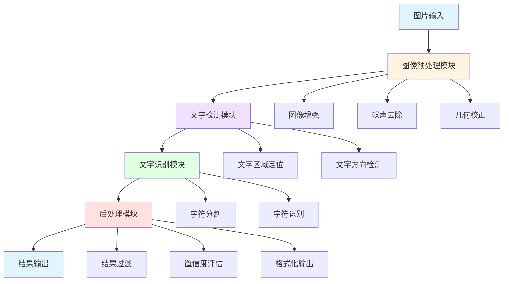

### 2.2 核心模块职责

| 模块名称 | 职责描述 | 输入 | 输出 |
|---------|---------|------|------|
| 图像预处理模块 | 提升图像质量,消除干扰因素 | 原始图片 | 预处理后的图片 |
| 文字检测模块 | 定位图片中的文字区域 | 预处理图片 | 文字区域坐标列表 |
| 文字识别模块 | 识别文字区域中的具体字符 | 文字区域图片 | 识别的文字及置信度 |
| 后处理模块 | 过滤无效结果,提升准确性 | 原始识别结果 | 最终识别结果 |
| 批处理模块 | 支持多图片批量处理 | 图片列表 | 结果列表 |
| 配置管理模块 | 管理系统参数和模型配置 | 配置文件 | 配置对象 |

### 2.3 数据流转

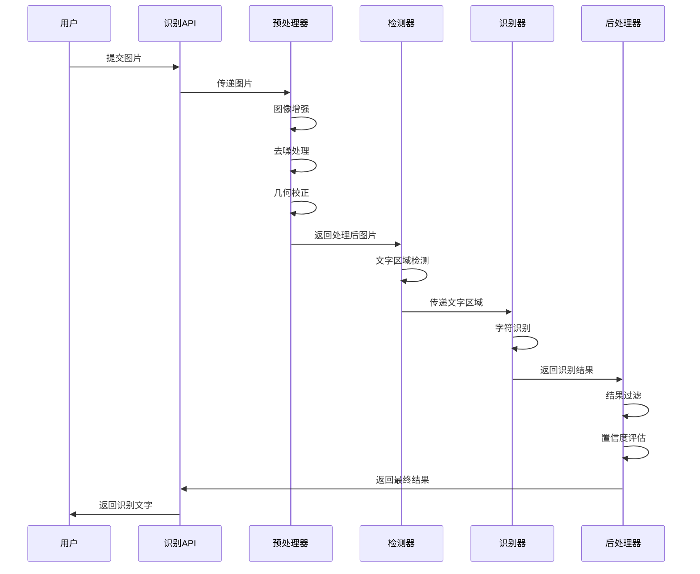

## 3. 图像预处理策略

### 3.1 预处理流程

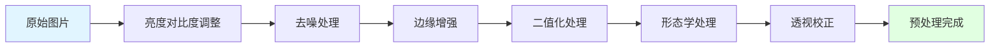

### 3.2 预处理技术细节

| 处理步骤 | 目的 | 应用技术 | 参数建议 |
|---------|------|---------|---------|
| 亮度对比度调整 | 处理光照不均问题 | 直方图均衡化、CLAHE自适应均衡 | clip_limit=2.0, tile_size=8x8 |
| 去噪处理 | 去除图像噪声和污渍 | 高斯滤波、中值滤波、双边滤波 | kernel_size=5, sigma=1.5 |
| 边缘增强 | 增强字母边缘信息 | Sobel算子、拉普拉斯算子 | kernel_size=3 |
| 二值化 | 分离文字和背景 | 自适应阈值、Otsu阈值 | block_size=11, C=2 |
| 形态学处理 | 连接断裂字符、去除小噪点 | 膨胀、腐蚀、开运算、闭运算 | kernel_size=3x3 |
| 透视校正 | 纠正拍摄角度倾斜 | 透视变换、仿射变换 | 基于边缘检测自动计算 |

### 3.3 针对轮毂特征的专项处理

#### 3.3.1 金属反光处理
- 采用多尺度Retinex算法抑制高光区域
- 使用局部自适应阈值避免全局阈值失效
- 高光区域单独处理后合并

#### 3.3.2 曲面文字处理
- 检测轮毂边缘曲线
- 估算曲率并进行逆变换
- 将曲面文字展平为平面文字

#### 3.3.3 凹凸字体处理
- 利用阴影信息增强字母轮廓
- 多角度光照模拟增强训练
- 边缘检测与形态学结合

## 4. 文字检测模块

### 4.1 检测策略

| 检测方法 | 原理 | 适用场景 | 优势 | 劣势 |
|---------|------|---------|------|------|
| DB (Differentiable Binarization) | 可微分二值化网络 | PaddleOCR默认检测器 | 速度快、准确率高 | 需要GPU加速 |
| EAST | 高效准确的场景文字检测 | 规则排列的文字 | 速度快、实现简单 | 多方向文字效果一般 |
| CRAFT | 字符区域感知 | 弯曲文字、艺术字 | 处理复杂布局能力强 | 速度较慢 |
| PixelLink | 像素链接分割 | 密集文字区域 | 分割准确 | 计算复杂度高 |

### 4.2 检测流程

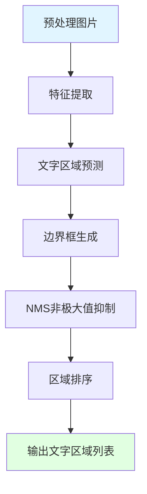

### 4.3 检测参数配置

| 参数名称 | 含义 | 推荐值 | 说明 |
|---------|------|--------|------|
| det_db_thresh | 二值化阈值 | 0.3 | 控制文字区域的敏感度 |
| det_db_box_thresh | 边界框阈值 | 0.5 | 过滤低置信度区域 |
| det_db_unclip_ratio | 边界扩展比例 | 1.6 | 扩大检测框防止截断 |
| max_side_len | 图片最大边长 | 960 | 平衡速度和精度 |
| use_dilation | 是否使用膨胀 | True | 连接断裂文字区域 |

## 5. 文字识别模块

### 5.1 识别策略

| 识别方法 | 技术架构 | 适用场景 | 特点 |
|---------|---------|---------|------|
| CRNN | CNN + RNN + CTC | 通用场景文字识别 | 经典方法、效果稳定 |
| SVTR | Single Visual Model for Scene Text Recognition | 复杂背景文字 | 精度高、速度快 |
| ABINet | 自主学习语言信息 | 模糊、遮挡文字 | 上下文理解能力强 |
| TrOCR | Transformer架构 | 手写、印刷混合 | 最新技术、鲁棒性强 |

### 5.2 识别流程

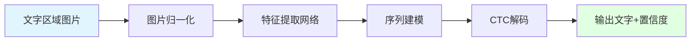

### 5.3 字符集定义

| 字符类型 | 字符范围 | 说明 |
|---------|---------|------|
| 大写字母 | A-Z | 轮毂上常见字母 |
| 小写字母 | a-z | 部分品牌使用小写 |
| 数字 | 0-9 | 型号、尺寸标识 |
| 特殊符号 | +-×/.空格 | 尺寸分隔符等 |

### 5.4 识别参数配置

| 参数名称 | 含义 | 推荐值 | 说明 |
|---------|------|--------|------|
| rec_algorithm | 识别算法 | SVTR_LCNet | 平衡速度和准确率 |
| rec_batch_num | 批处理大小 | 6 | 根据GPU内存调整 |
| rec_image_shape | 输入图像尺寸 | 3,48,320 | 高度固定,宽度自适应 |
| max_text_length | 最大文字长度 | 25 | 适应轮毂标识长度 |

## 6. 后处理与结果优化

### 6.1 后处理流程

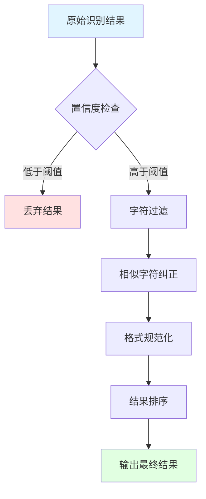

### 6.2 结果过滤规则

| 过滤类型 | 规则描述 | 示例 |
|---------|---------|------|
| 置信度过滤 | 丢弃置信度低于阈值的结果 | 置信度 < 0.6 的结果 |
| 长度过滤 | 过滤异常长度的识别结果 | 长度 < 2 或 > 30 的结果 |
| 字符类型过滤 | 只保留字母数字和特定符号 | 过滤掉中文、表情等 |
| 重复结果过滤 | 合并重复或高度相似的结果 | 相似度 > 0.9 的结果合并 |
| 空白结果过滤 | 过滤纯空格或空字符串 | 去除 "", "   " 等 |

### 6.3 相似字符纠正

| 易混淆字符对 | 纠正策略 | 依据 |
|------------|---------|------|
| O 与 0 | 根据上下文判断 | 周围是字母则为O,周围是数字则为0 |
| I 与 1 与 l | 根据字体特征和上下文 | 优先识别为常见品牌字母 |
| S 与 5 | 根据位置和上下文 | 品牌名通常为字母 |
| Z 与 2 | 边缘特征区分 | Z有斜线,2有弧线 |
| B 与 8 | 闭合区域数量 | B一个分割线,8两个闭合环 |

### 6.4 结果输出格式

#### 6.4.1 单条识别结果结构

| 字段名 | 类型 | 说明 | 示例 |
|-------|------|------|------|
| text | 字符串 | 识别的文字内容 | "BBS" |
| confidence | 浮点数 | 识别置信度(0-1) | 0.95 |
| bbox | 坐标数组 | 文字区域坐标(左上、右上、右下、左下) | [[10,20],[100,20],[100,50],[10,50]] |
| orientation | 字符串 | 文字方向 | "horizontal" / "vertical" |

#### 6.4.2 完整输出结构

| 字段名 | 类型 | 说明 |
|-------|------|------|
| image_path | 字符串 | 原始图片路径 |
| total_texts | 整数 | 检测到的文字区域数量 |
| results | 数组 | 所有识别结果列表 |
| processing_time | 浮点数 | 处理耗时(秒) |
| engine_used | 字符串 | 使用的识别引擎 |

## 7. 核心功能设计

### 7.1 单图片识别功能

#### 7.1.1 功能流程

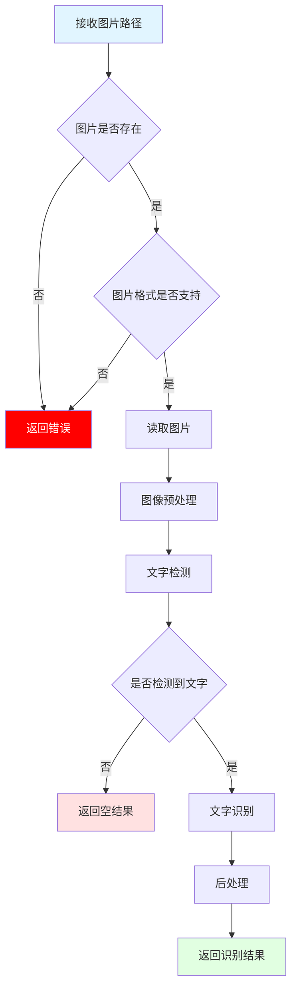

#### 7.1.2 输入输出规范

| 项目 | 描述 |
|------|------|
| **输入** | 图片文件路径 或 图片二进制数据 或 图片URL |
| **支持格式** | JPG, PNG, BMP, TIFF, WEBP |
| **图片大小限制** | 最小 100x100, 最大 4096x4096 |
| **输出** | 识别结果对象(包含文字、位置、置信度) |

### 7.2 批量识别功能

#### 7.2.1 批处理策略

| 策略 | 描述 | 优势 | 适用场景 |
|------|------|------|---------|
| 串行处理 | 逐张图片依次处理 | 内存占用低、稳定性高 | 图片数量少、资源受限 |
| 并行处理 | 多线程/多进程同时处理 | 速度快、效率高 | 图片数量多、多核CPU |
| 批次处理 | 分批加载和处理 | 平衡速度和资源 | 大量图片处理 |

#### 7.2.2 批处理流程

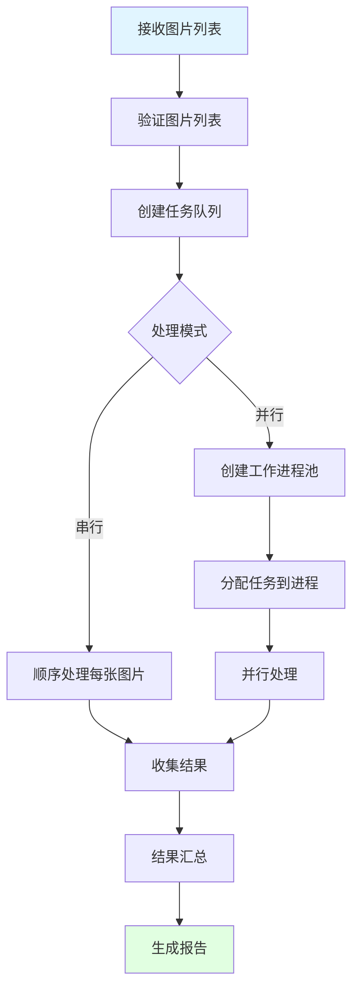

### 7.3 区域裁剪识别功能

#### 7.3.1 功能描述
允许用户指定图片中的特定区域进行识别,提高识别精度和速度。

#### 7.3.2 裁剪模式

| 模式 | 描述 | 输入参数 |
|------|------|---------|
| 矩形裁剪 | 指定矩形区域坐标 | x, y, width, height |
| 多边形裁剪 | 指定多边形顶点 | 顶点坐标列表 |
| 自动裁剪 | 自动检测主体区域 | 无需参数 |

### 7.4 多角度融合识别功能

#### 7.4.1 功能价值
多角度拍摄同一轮毂可以显著提升识别准确率,原因如下:
- **互补性**: 不同角度可以避免某个角度的反光、遮挡问题
- **完整性**: 某些字符在特定角度下更清晰
- **验证性**: 多次识别结果可以相互验证,降低误识别
- **鲁棒性**: 通过投票机制过滤噪声结果

#### 7.4.2 多角度识别策略

| 策略类型 | 描述 | 适用场景 | 准确率提升 |
|---------|------|---------|----------|
| 结果合并 | 将所有角度识别的文字合并去重 | 字符分散在不同位置 | +10-15% |
| 投票机制 | 相同位置的文字以高频结果为准 | 识别同一区域文字 | +15-25% |
| 置信度加权 | 根据置信度对结果加权融合 | 质量参差不齐的图片 | +20-30% |
| 智能选择 | 自动选择最清晰角度的结果 | 有明显质量差异 | +10-20% |

#### 7.4.3 多角度融合流程

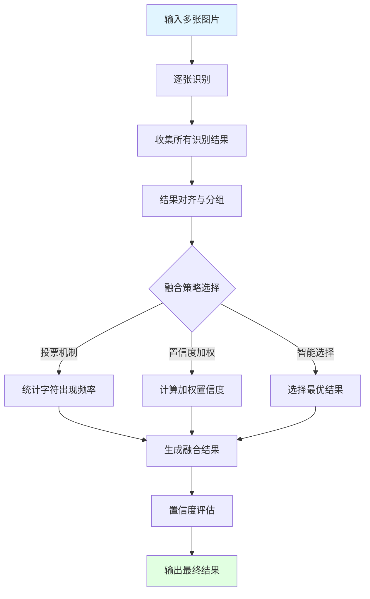

#### 7.4.4 结果对齐算法

**目标**: 识别多张图片中的同一文字区域

| 对齐方法 | 原理 | 优势 | 适用条件 |
|---------|------|------|----------|
| 位置对齐 | 根据文字在图片中的相对位置 | 简单快速 | 拍摄角度相近 |
| 内容相似度 | 计算文字内容的编辑距离 | 准确度高 | 识别结果较准确 |
| 语义匹配 | 基于轮毂知识库匹配 | 智能化 | 已知品牌型号 |
| 混合匹配 | 结合位置、内容、语义 | 鲁棒性强 | 通用场景(推荐) |

#### 7.4.5 投票融合算法

**核心思想**: 多数投票 + 置信度加权

融合规则:
1. 对相同位置的文字进行分组
2. 计算每个候选结果的综合得分 = 出现次数 × 平均置信度
3. 选择得分最高的结果作为最终输出
4. 如果得分接近,保留多个候选结果供用户选择

**融合公式**:
```
综合得分 = (出现次数 / 总图片数) × 平均置信度 × 长度权重
长度权重 = min(文字长度 / 3, 1.5)  # 偏好较长的识别结果
```

#### 7.4.6 最佳实践建议

| 建议项 | 说明 | 原因 |
|-------|------|------|
| 图片数量 | 3-5张为最佳 | 平衡效果与效率 |
| 拍摄角度 | 间隔30-45度 | 避免角度过于相似或差异过大 |
| 拍摄重点 | 确保目标文字都在画面中 | 每张图覆盖完整信息 |
| 光照条件 | 尽量保持一致 | 减少预处理差异 |
| 焦点清晰 | 至少保证2张清晰 | 提供高质量基准 |

#### 7.4.7 输出结果结构

多角度融合识别的输出结果:

| 字段名 | 类型 | 说明 | 示例 |
|-------|------|------|------|
| merged_text | 字符串 | 融合后的最终文字 | "BBS CH-R 18×8.5J" |
| confidence | 浮点数 | 综合置信度 | 0.92 |
| source_count | 整数 | 来源图片数量 | 4 |
| individual_results | 数组 | 每张图片的识别结果 | [...] |
| fusion_method | 字符串 | 使用的融合方法 | "voting" |
| alternatives | 数组 | 备选结果(得分接近的) | [{"text": "...", "score": 0.88}] |

### 7.5 结果可视化功能

#### 7.5.1 可视化类型

| 可视化类型 | 描述 | 应用场景 |
|-----------|------|---------|
| 边框标注 | 在原图上绘制识别文字的边界框 | 验证检测效果 |
| 文字标注 | 在边界框旁显示识别出的文字 | 直观展示结果 |
| 置信度标注 | 用颜色或数字表示置信度 | 评估识别质量 |
| 对比图 | 原图与标注图并排显示 | 报告和演示 |
| 多角度对比 | 多张图片识别结果并排展示 | 多角度融合分析 |

#### 7.5.2 可视化流程

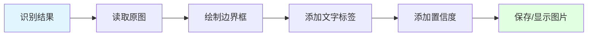

## 8. 模型与引擎集成

### 8.1 PaddleOCR 集成方案

#### 8.1.1 模型选择

| 模型类型 | 模型名称 | 大小 | 速度 | 精度 | 推荐场景 |
|---------|---------|------|------|------|---------|
| 超轻量级 | ch_PP-OCRv4_mobile | 10MB | 极快 | 较高 | 移动端、资源受限 |
| 服务器版 | ch_PP-OCRv4_server | 110MB | 快 | 很高 | 服务器部署 |
| 英文专用 | en_PP-OCRv4 | 12MB | 极快 | 高 | 纯英文场景(推荐) |

#### 8.1.2 初始化配置

| 配置项 | 说明 | 推荐值 |
|-------|------|--------|
| use_angle_cls | 是否使用方向分类器 | True |
| lang | 语言类型 | 'en' (英文) |
| use_gpu | 是否使用GPU | True (如有GPU) |
| det_model_dir | 检测模型路径 | 自动下载 |
| rec_model_dir | 识别模型路径 | 自动下载 |
| cls_model_dir | 方向分类模型路径 | 自动下载 |

### 8.2 EasyOCR 集成方案

#### 8.2.1 语言配置

| 配置项 | 说明 | 推荐值 |
|-------|------|--------|
| lang_list | 识别语言列表 | ['en'] |
| gpu | 是否启用GPU | True |
| model_storage_directory | 模型存储路径 | './models/easyocr' |
| download_enabled | 是否允许下载模型 | True |

#### 8.2.2 识别参数

| 参数名 | 说明 | 推荐值 |
|-------|------|--------|
| decoder | 解码方式 | 'beamsearch' |
| beamWidth | 束搜索宽度 | 5 |
| batch_size | 批处理大小 | 1 |
| workers | 工作线程数 | 0 (自动) |
| allowlist | 允许字符白名单 | 'ABCDEFGHIJKLMNOPQRSTUVWXYZ0123456789' |
| paragraph | 是否合并段落 | False |

### 8.3 多引擎切换策略

#### 8.3.1 切换决策流程

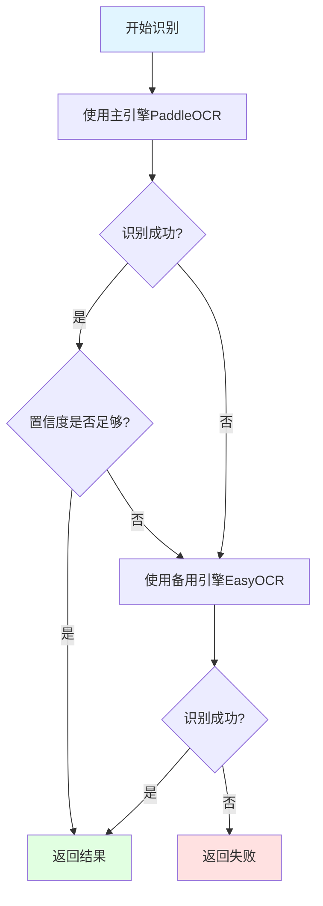

#### 8.3.2 引擎选择策略

| 场景 | 主引擎 | 备用引擎 | 原因 |
|------|-------|---------|------|
| 规则印刷字体 | PaddleOCR | EasyOCR | PaddleOCR速度更快 |
| 艺术字体 | EasyOCR | PaddleOCR | EasyOCR鲁棒性更强 |
| 模糊图片 | EasyOCR | PaddleOCR | EasyOCR容错能力强 |
| 批量处理 | PaddleOCR | 无 | 优先考虑速度 |
| 高精度要求 | 双引擎投票 | - | 结合两者结果 |

## 9. 配置管理

### 9.1 配置文件结构

| 配置分类 | 配置项 | 说明 |
|---------|-------|------|
| **预处理配置** | enable_preprocessing | 是否启用预处理 |
| | brightness_contrast | 亮度对比度调整参数 |
| | denoise_method | 去噪方法选择 |
| | edge_enhancement | 边缘增强参数 |
| | binarization_method | 二值化方法 |
| **检测配置** | detection_engine | 检测引擎选择 |
| | det_db_thresh | DB检测阈值 |
| | det_db_box_thresh | 边界框阈值 |
| | max_side_len | 最大边长限制 |
| **识别配置** | recognition_engine | 识别引擎选择 |
| | rec_algorithm | 识别算法 |
| | rec_batch_num | 批处理大小 |
| | character_whitelist | 字符白名单 |
| **后处理配置** | min_confidence | 最小置信度阈值 |
| | enable_correction | 是否启用字符纠正 |
| | enable_filtering | 是否启用结果过滤 |
| **系统配置** | use_gpu | 是否使用GPU |
| | num_workers | 并行工作进程数 |
| | log_level | 日志级别 |
| | model_cache_dir | 模型缓存目录 |

### 9.2 配置加载优先级

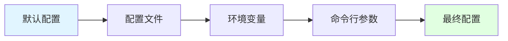

## 10. 异常处理与容错

### 10.1 异常类型定义

| 异常类型 | 触发条件 | 处理策略 |
|---------|---------|---------|
| ImageNotFoundError | 图片文件不存在 | 返回错误信息,跳过该图片 |
| ImageFormatError | 图片格式不支持 | 尝试转换格式,失败则返回错误 |
| ImageTooLargeError | 图片尺寸超限 | 自动缩放到最大尺寸 |
| ImageTooSmallError | 图片尺寸过小 | 返回警告,尝试识别 |
| ModelLoadError | 模型加载失败 | 切换到备用引擎 |
| NoTextDetectedError | 未检测到文字 | 返回空结果 |
| LowConfidenceError | 识别置信度过低 | 切换备用引擎重试 |
| GPUOutOfMemoryError | GPU内存不足 | 切换到CPU模式 |

### 10.2 重试机制

#### 10.2.1 重试策略

| 场景 | 重试次数 | 重试间隔 | 降级策略 |
|------|---------|---------|---------|
| 网络模型下载失败 | 3次 | 2秒 | 使用本地缓存模型 |
| GPU推理失败 | 1次 | 0秒 | 切换到CPU |
| 识别置信度低 | 1次 | 0秒 | 使用备用引擎 |
| 临时文件读写失败 | 2次 | 1秒 | 使用内存处理 |

#### 10.2.2 重试流程

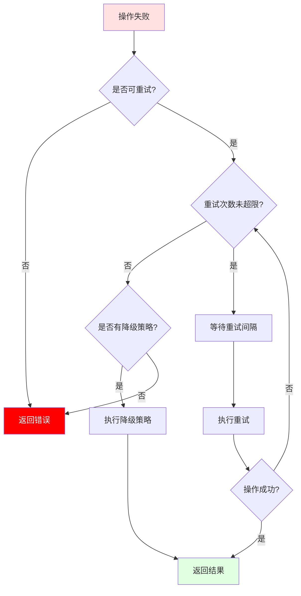

## 11. 性能优化策略

### 11.1 性能优化维度

| 优化维度 | 优化手段 | 预期效果 |
|---------|---------|---------|
| **推理速度** | 使用轻量级模型 | 提升2-3倍速度 |
| | GPU加速 | 提升5-10倍速度 |
| | 批量推理 | 提升30%吞吐量 |
| | 模型量化 | 提升1.5-2倍速度 |
| **内存占用** | 图片分块处理 | 降低50%内存峰值 |
| | 及时释放中间结果 | 降低30%平均内存 |
| | 模型共享 | 降低多进程内存消耗 |
| **准确率** | 图像预处理增强 | 提升5-10%准确率 |
| | 多引擎结果融合 | 提升3-5%准确率 |
| | 针对性模型微调 | 提升10-20%准确率 |

### 11.2 性能基准

| 场景 | 图片尺寸 | 预期耗时(CPU) | 预期耗时(GPU) |
|------|---------|--------------|--------------|
| 单张图片识别 | 1920x1080 | 2-3秒 | 0.5-1秒 |
| 单张图片识别 | 4096x3072 | 5-8秒 | 1-2秒 |
| 批量处理(10张) | 1920x1080 | 20-25秒 | 5-8秒 |
| 批量处理(100张) | 1920x1080 | 180-220秒 | 40-60秒 |

### 11.3 缓存策略

| 缓存类型 | 缓存内容 | 缓存时长 | 失效条件 |
|---------|---------|---------|---------|
| 模型缓存 | 加载的模型对象 | 应用生命周期 | 应用关闭 |
| 预处理结果缓存 | 预处理后的图片 | 单次请求周期 | 请求结束 |
| 配置缓存 | 配置文件内容 | 应用生命周期 | 配置文件修改 |

## 12. 测试策略

### 12.1 测试数据集构建

| 数据类型 | 数量 | 来源 | 特点 |
|---------|------|------|------|
| 标准拍摄图片 | 100张 | 实际手机拍摄 | 光照正常、角度正常 |
| 低光照图片 | 50张 | 实际拍摄 | 傍晚、阴天拍摄 |
| 强光反射图片 | 50张 | 实际拍摄 | 强光直射、高光反射 |
| 倾斜角度图片 | 50张 | 实际拍摄 | 不同角度拍摄 |
| 模糊图片 | 30张 | 实际拍摄 | 手抖、焦点不准 |
| 污渍遮挡图片 | 30张 | 实际拍摄 | 泥土、水渍遮挡 |

### 12.2 测试指标

| 指标类型 | 指标名称 | 计算方式 | 目标值 |
|---------|---------|---------|--------|
| **准确性指标** | 字符识别准确率 | 正确识别字符数 / 总字符数 | ≥ 90% |
| | 文字检测召回率 | 检测到的文字区域 / 实际文字区域 | ≥ 95% |
| | 文字检测精确率 | 正确的检测区域 / 所有检测区域 | ≥ 90% |
| | 端到端识别准确率 | 完全正确的识别结果 / 总样本数 | ≥ 85% |
| **性能指标** | 平均处理时间 | 总处理时间 / 图片数量 | ≤ 2秒/张(GPU) |
| | 内存峰值 | 最大内存占用 | ≤ 2GB |
| | GPU利用率 | GPU计算时间 / 总时间 | ≥ 70% |
| **鲁棒性指标** | 异常处理成功率 | 正确处理的异常 / 总异常数 | 100% |
| | 边缘案例识别率 | 边缘案例正确数 / 边缘案例总数 | ≥ 70% |

### 12.3 测试用例设计

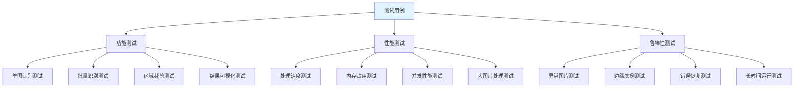

### 12.4 单元测试覆盖

| 模块 | 测试重点 | 覆盖率目标 |
|------|---------|-----------|
| 图像预处理模块 | 各种预处理算法的正确性 | ≥ 80% |
| 文字检测模块 | 检测框准确性、边界情况 | ≥ 75% |
| 文字识别模块 | 识别准确性、字符集覆盖 | ≥ 75% |
| 后处理模块 | 过滤规则、纠正逻辑 | ≥ 85% |
| 配置管理模块 | 配置加载、参数验证 | ≥ 90% |
| 异常处理模块 | 各类异常捕获和处理 | ≥ 95% |

## 13. 模型优化与定制化

### 13.1 模型微调策略

#### 13.1.1 微调必要性评估

| 场景 | 是否需要微调 | 原因 |
|------|------------|------|
| 通用轮毂字母识别 | 可选 | 预训练模型已有较好效果 |
| 特定品牌轮毂 | 推荐 | 提升特定字体识别率 |
| 磨损严重的轮毂 | 强烈推荐 | 提升鲁棒性 |
| 特殊材质轮毂 | 推荐 | 适应特殊反光特性 |

#### 13.1.2 微调数据集要求

| 数据集要素 | 最小要求 | 推荐规模 | 说明 |
|-----------|---------|---------|------|
| 样本数量 | 500张 | 2000+张 | 更多数据提升泛化能力 |
| 标注质量 | 准确率95%+ | 准确率99%+ | 高质量标注至关重要 |
| 数据多样性 | 覆盖5种以上场景 | 覆盖10种以上场景 | 包含不同光照、角度、品牌 |
| 标注格式 | 文字级别标注 | 字符级别标注 | 字符级标注更精细 |

#### 13.1.3 微调流程

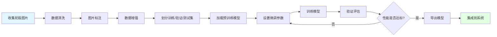

### 13.2 数据增强策略

| 增强方法 | 目的 | 参数范围 |
|---------|------|---------|
| 随机旋转 | 模拟不同拍摄角度 | -15° 到 +15° |
| 亮度调整 | 模拟不同光照条件 | 0.7 到 1.3倍 |
| 对比度调整 | 增强鲁棒性 | 0.8 到 1.2倍 |
| 高斯噪声 | 模拟图像噪声 | 标准差 0-10 |
| 模糊处理 | 模拟焦点不准 | 核大小 3-7 |
| 透视变换 | 模拟不同视角 | 轻度透视变换 |
| 局部遮挡 | 模拟污渍遮挡 | 遮挡比例 5-15% |

### 13.3 模型压缩与加速

| 技术 | 原理 | 压缩比 | 速度提升 | 精度损失 |
|------|------|--------|---------|---------|
| 模型量化 | 降低参数精度(FP32→INT8) | 4倍 | 2-3倍 | <2% |
| 模型剪枝 | 删除冗余参数 | 2-3倍 | 1.5-2倍 | 1-3% |
| 知识蒸馏 | 小模型学习大模型 | 3-5倍 | 3-4倍 | 2-5% |
| ONNX Runtime | 统一推理框架优化 | - | 1.3-1.8倍 | 0% |

## 14. 应用部署形态

### 14.1 部署形态对比

| 部署形态 | 适用场景 | 优势 | 劣势 |
|---------|---------|------|------|
| 命令行工具 | 开发测试、脚本调用 | 简单灵活、易于集成 | 交互性差 |
| Web API服务 | 多客户端访问、云端部署 | 集中管理、易于扩展 | 需要网络依赖 |
| 桌面应用 | 单机使用、离线环境 | 用户体验好、无需网络 | 分发维护复杂 |
| 移动应用 | 现场拍照识别 | 便携、即拍即识 | 模型体积受限 |
| Docker容器 | 微服务架构、云原生 | 环境一致、易于部署 | 需要容器环境 |

### 14.2 Web API 服务设计

#### 14.2.1 API 端点定义

| 端点 | 方法 | 描述 | 输入 | 输出 |
|------|------|------|------|------|
| `/api/recognize` | POST | 识别单张图片 | 图片文件 | 识别结果JSON |
| `/api/recognize/batch` | POST | 批量识别 | 图片文件列表 | 批量结果JSON |
| `/api/recognize/multi-angle` | POST | 多角度融合识别 | 同一物体的多张图片 | 融合结果JSON |
| `/api/recognize/url` | POST | 识别图片URL | 图片URL | 识别结果JSON |
| `/api/health` | GET | 健康检查 | 无 | 服务状态 |
| `/api/models` | GET | 获取可用模型列表 | 无 | 模型列表 |

#### 14.2.2 请求响应格式

**请求示例(单图识别)**
- 请求方法: POST
- Content-Type: multipart/form-data
- 请求参数:
  - image: 图片文件(必需)
  - engine: 识别引擎,可选值 paddleocr/easyocr/auto(可选,默认auto)
  - visualize: 是否返回可视化图片,布尔值(可选,默认false)
  - confidence_threshold: 置信度阈值,0-1之间(可选,默认0.6)

**请求示例(多角度融合识别)**
- 请求方法: POST
- Content-Type: multipart/form-data
- 请求参数:
  - images: 多个图片文件(必需,建议3-5张)
  - fusion_method: 融合方法,可选值 voting/weighted/smart/merge(可选,默认voting)
  - engine: 识别引擎(可选,默认auto)
  - visualize: 是否返回可视化图片(可选,默认false)
  - confidence_threshold: 置信度阈值(可选,默认0.6)
  - return_alternatives: 是否返回备选结果,布尔值(可选,默认true)

**响应示例**
- 状态码: 200
- Content-Type: application/json
- 响应字段:
  - success: 布尔值,表示是否成功
  - message: 字符串,描述信息
  - data: 对象,包含识别结果
    - texts: 数组,所有识别的文字列表
    - details: 数组,详细结果(文字、置信度、坐标)
    - processing_time: 浮点数,处理耗时
    - engine_used: 字符串,使用的引擎
  - visualization_url: 字符串,可视化图片URL(如果请求了)

#### 14.2.3 API 调用流程

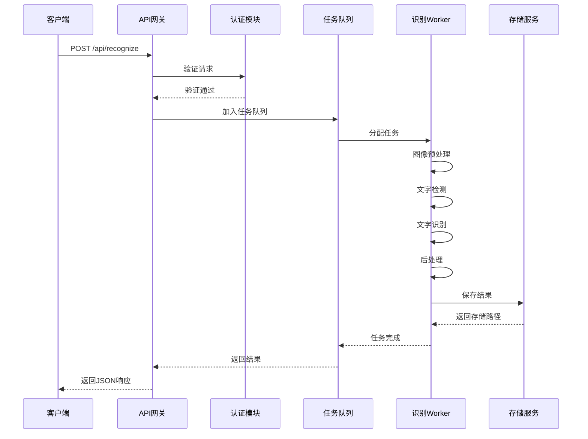

### 14.3 命令行工具设计

#### 14.3.1 命令格式

| 命令 | 描述 | 示例 |
|------|------|------|
| `recognize <image>` | 识别单张图片 | `recognize wheel.jpg` |
| `recognize <dir>` | 批量识别目录下所有图片 | `recognize ./images/` |
| `recognize --multi <images...>` | 多角度融合识别 | `recognize --multi img1.jpg img2.jpg img3.jpg` |
| `recognize --url <url>` | 识别网络图片 | `recognize --url https://example.com/image.jpg` |

#### 14.3.2 命令行参数

| 参数 | 简写 | 类型 | 默认值 | 描述 |
|------|------|------|--------|------|
| --engine | -e | 字符串 | auto | 指定识别引擎 |
| --output | -o | 字符串 | stdout | 输出路径 |
| --visualize | -v | 布尔 | false | 生成可视化图片 |
| --confidence | -c | 浮点 | 0.6 | 置信度阈值 |
| --format | -f | 字符串 | json | 输出格式(json/text/csv) |
| --gpu | -g | 布尔 | false | 是否使用GPU |
| --batch-size | -b | 整数 | 1 | 批处理大小 |
| --fusion-method | -m | 字符串 | voting | 多角度融合方法(voting/weighted/smart) |
| --show-alternatives | -a | 布尔 | false | 显示备选识别结果 |
| --verbose | - | 布尔 | false | 详细输出 |

## 15. 扩展功能

### 15.1 轮毂信息结构化提取

#### 15.1.1 提取目标

| 信息类型 | 描述 | 示例 | 识别难度 |
|---------|------|------|---------|
| 品牌名称 | 轮毂制造商 | BBS, OZ, RAYS | 中等 |
| 型号 | 具体产品型号 | CH-R, LM, TE37 | 中等 |
| 尺寸信息 | 直径、宽度、偏距 | 18×8.5J ET35 | 较高 |
| 材质标识 | 材料类型 | FORGED, CAST | 较低 |
| 认证标志 | 质量认证标识 | JWL, VIA | 中等 |

#### 15.1.2 结构化流程

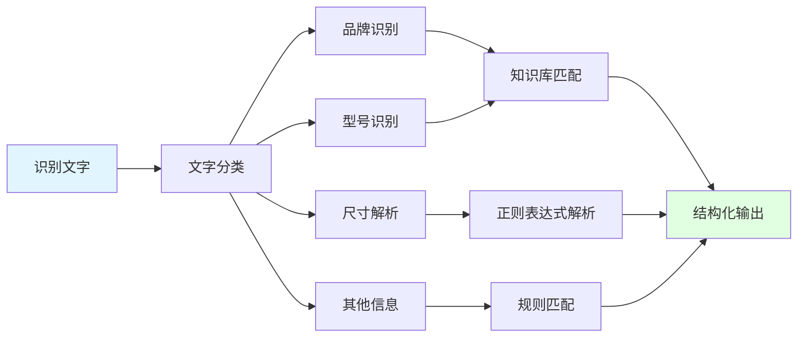

### 15.2 多语言支持

| 语言 | 使用场景 | 实现难度 | 优先级 |
|------|---------|---------|--------|
| 英文 | 欧美品牌轮毂 | 低(已支持) | 高 |
| 中文 | 国产品牌轮毂 | 中等 | 中 |
| 日文 | 日本品牌轮毂 | 中等 | 中 |
| 德文 | 德国品牌轮毂 | 中等 | 低 |

### 15.3 历史记录与统计

#### 15.3.1 记录内容

| 记录项 | 说明 |
|-------|------|
| 识别时间 | 每次识别的时间戳 |
| 图片信息 | 图片路径、尺寸、格式 |
| 识别结果 | 识别的文字内容 |
| 置信度 | 识别置信度分数 |
| 处理耗时 | 完整处理流程耗时 |
| 使用引擎 | 使用的识别引擎 |

#### 15.3.2 统计维度

| 统计维度 | 指标 |
|---------|------|
| 使用统计 | 总识别次数、成功率、失败率 |
| 性能统计 | 平均处理时间、最长/最短耗时 |
| 质量统计 | 平均置信度、高/低置信度比例 |
| 引擎统计 | 各引擎使用次数、成功率对比 |

### 15.4 在线学习与反馈

#### 15.4.1 反馈机制

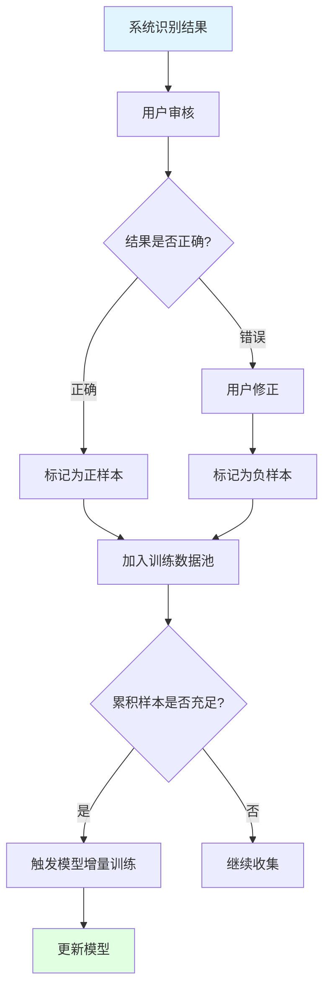

#### 15.4.2 增量学习策略

| 策略 | 描述 | 触发条件 | 更新周期 |
|------|------|---------|---------|
| 定期更新 | 固定周期重新训练 | 时间到达 | 每月一次 |
| 样本驱动 | 积累足够样本后训练 | 样本数≥1000 | 按需触发 |
| 性能驱动 | 性能下降时触发 | 准确率下降>5% | 实时监控 |
| 混合策略 | 结合多种触发条件 | 任一条件满足 | 灵活调整 |
